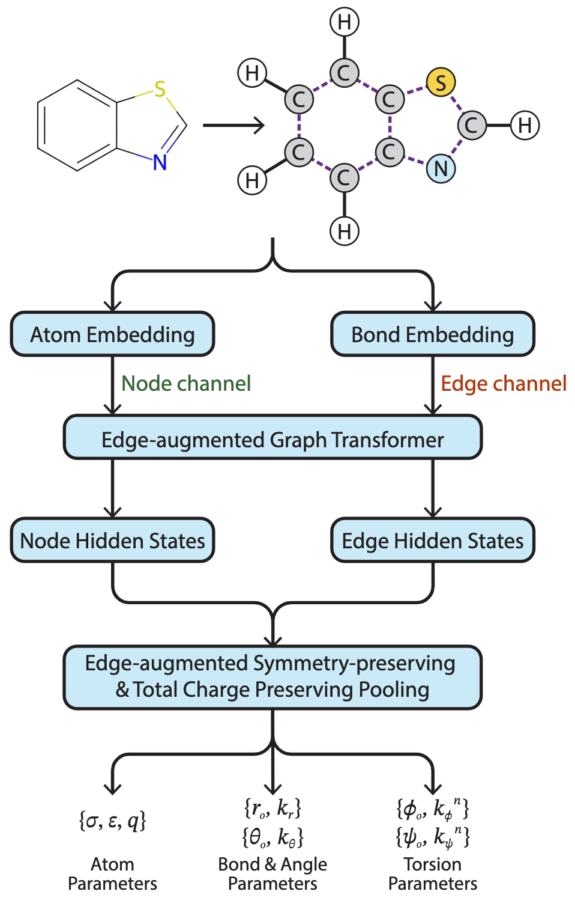

# ByteFF (ByteDance Force Field)
Welcome to the repository of ByteFF!
 This repository hosts the source code for ByteFF paper.

## Model architecture


## Data preparation
There are three types of data used in training process:
- Partial hessian data, containing coordinates, partial hessians and forcefield parameters for pretraining.
- Torsion data, containing coordinates, energies and torsion_ids.
- Energy force data, containing coordinates, energies and forces.

See `scripts/prepare_data/README.md` for detailed instructions.

## Training
There are three stage of training:
- Pretraining with partial hessian data.
- Traing with partial hessian and torsion data.
- Finetuning with energy force data.

See `scripts/train/README.md` for detailed instructions.

## Output forcefield parameters
The trained model can be used to infer forcefield parameters given a molecule.\
The output format is `.itp` file, which is compatible with Gromacs.

Use `scripts/write_itp/write_itp.py` and `scripts/write_itp/write_itp_ensemble.py`

## Data availability
BDTorsion benchmark data are accessible in the `data` folder.
Please adhere to the Apache 2.0 license and cite our paper if you utilize this data.

## Citing ByteFF

If you use ByteFF in your research, please cite:
```
@article{zheng2024data,
  title={Data-Driven Parametrization of Molecular Mechanics Force Fields for Expansive Chemical Space Coverage},
  author={Zheng, Tianze and Wang, Ailun and Han, Xu and Xia, Yu and Xu, Xingyuan and Zhan, Jiawei and Liu, Yu and Chen, Yang and Wang, Zhi and Wu, Xiaojie and others},
  journal={arXiv preprint arXiv:2408.12817},
  year={2024}
}
```

## License

This project is licensed under the [Apache License, Version 2.0](http://www.apache.org/licenses/LICENSE-2.0).
