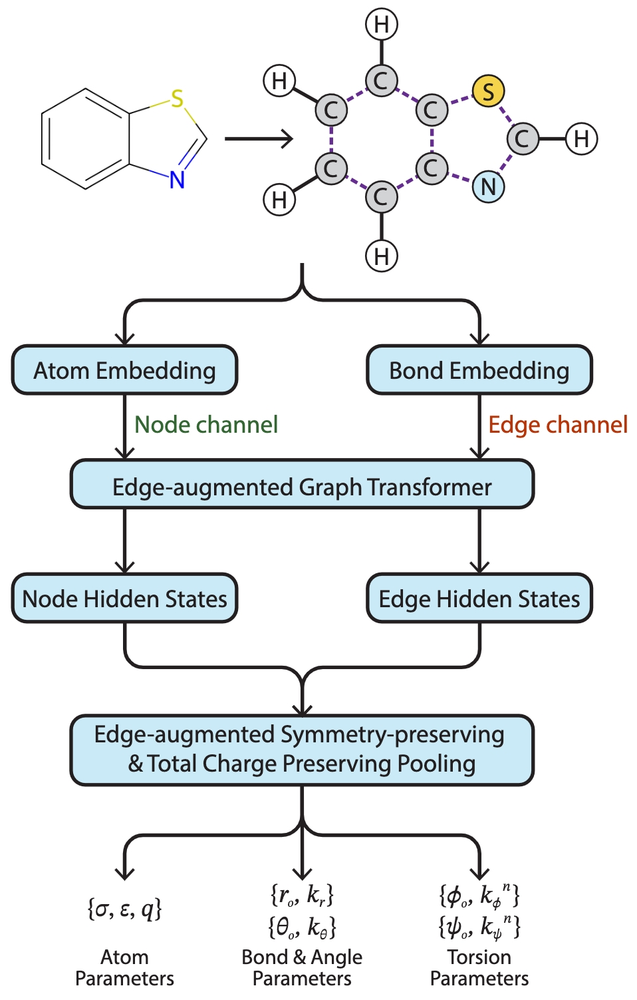

# [Archived] ByteFF (ByteDance Force Field)
This repository has been archived and is no longer maintained. For the latest ByteFF models, code, and documentation, please visit the [ByteFF2 repository](https://github.com/ByteDance-Seed/byteff2).

Welcome to the repository of ByteFF!
 This repository hosts the source code for ByteFF paper.

## Use ByteFF
We offer a free trial of ByteFF through our API service.

For further details, please reach out to zhengtianze@bytedance.com.

## Model architecture


## Data preparation
There are three types of data used in training process:
- Partial hessian data, containing coordinates, partial hessians and forcefield parameters for pretraining.
- Torsion data, containing coordinates, energies and torsion_ids.
- Energy force data, containing coordinates, energies and forces.

See `scripts/prepare_data/README.md` for detailed instructions.

## Training
There are three stage of training:
- Pretraining with partial hessian data.
- Traing with partial hessian and torsion data.
- Finetuning with energy force data.

See `scripts/train/README.md` for detailed instructions.

## Output forcefield parameters
The trained model can be used to infer forcefield parameters given a molecule.\
The output format is `.itp` file, which is compatible with Gromacs.

Use `scripts/write_itp/write_itp.py` and `scripts/write_itp/write_itp_ensemble.py`

## Data availability
BDTorsion benchmark data are accessible in the `data` folder.
Please adhere to the Apache 2.0 license and cite our paper if you utilize this data.

## Citing ByteFF

If you use ByteFF in your research, please cite:
```
@Article{D4SC06640E,
author ="Zheng, Tianze and Wang, Ailun and Han, Xu and Xia, Yu and Xu, Xingyuan and Zhan, Jiawei and Liu, Yu and Chen, Yang and Wang, Zhi and Wu, Xiaojie and Gong, Sheng and Yan, Wen",
title  ="Data-driven parametrization of molecular mechanics force fields for expansive chemical space coverage",
journal  ="Chem. Sci.",
year  ="2025",
pages  ="-",
publisher  ="The Royal Society of Chemistry",
doi  ="10.1039/D4SC06640E",
url  ="http://dx.doi.org/10.1039/D4SC06640E"}
```

## License

This project is licensed under the [Apache License, Version 2.0](http://www.apache.org/licenses/LICENSE-2.0).
